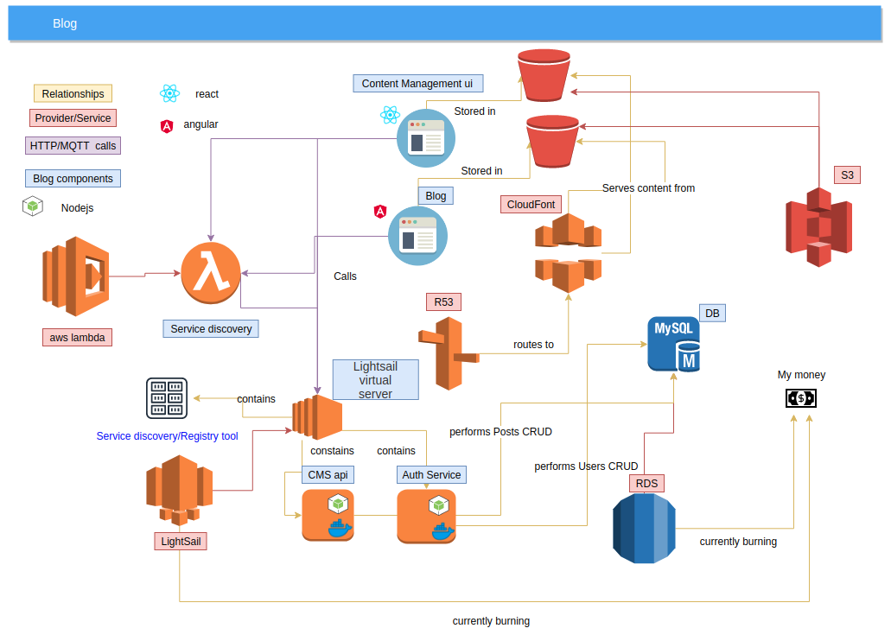

# Dev-Blog
### despair driven development

This is a simple multi-user blog/cms using Nestjs angular and react

I'm currently using multiple service from the aws stack such as:
* Lambda for calls to the consul endpoint to know the location of other services
* Lightsail to host my servers :(It was a cheap way to get the project started and i can always upgrade to ECS later)
* RDS for user and post data persistence: I wanted to avoid a NoSQL db
    * The data structure is mostly consistent
     * i wanted to avoid redundancy
     * it's easier for organizing and visualizing data
 * I may add Dynamo or something else if i start dealing with data from unstructured sources 
 * S3 for static site hosting
 * r53 and Cloudfont as DNS service and cdn 
      
The architecture right now, is a bit of a mess, so it is subject to change

---

## Features , Progress & stack
- [ ] User login/sign up (WIp)
  * Dotnet core (C#)
  * AWS Cognito
  * Entity framework Core  
  * RDS (MySql)
  * React
- [ ] Content viewing (Posts)(WIP)
  * Angular
- [ ] Content management and creation(WIP)
  * Typescript
  * RDS (MySql)
  * TypeORM
  * Nestjs
  * React
- [ ] Post templates creation and selection
- [ ] Post versioning (Draft/updates)
- [ ] Comments
- [ ] Chat
- [ ] Email notification
- [ ] Virtual meetings
- [ ] Post Fuzzy search
  * SpringBoot (JAVA)
  * Elasticsearch
  * JAVA
## link
http://despairdrivendevelopment.net/
