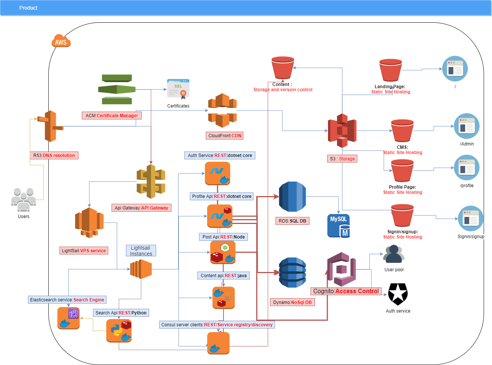

# Dev-Blog

### despair driven development
> https://despairdrivendevelopment.net/

This is a developer-focused social platform that allows devs (be it veterans or newcomers) to share their experience, network and discuss on the software industry-related topics

## Architecture 

I'm currently using multiple service from the aws stack such as:
* Lambda for calls to the consul endpoint to know the location of other services
* Lightsail to host my servers :(It was a cheap way to get the project started and i can always upgrade later)
* RDS for user and post data persistence:
    * The data structure is mostly consistent
     * i wanted to avoid redundancy
     * it's easier for organizing and visualizing data
 * Dynamodb for read-only version of data
 * S3 for static site hosting and file storage
 * r53 and Cloudfont as DNS service and cdn 
 * Cognito for access control
 
 The Architecture is subject to change

---
## Repositories
### [Landing page](https://github.com/PierreStephaneVoltaire/dev-blog)

### Description
This is the main app the user will be interacting with too view posts and interact with various other features of the website.
#### Stack, Services & Tools
* Angular
* Typescript
* Terraform
* S3
* CloudFont
* R53
### Features
- [X] post viewing
- [ ] Signin/signup
- [ ] Search
### Post API

### Description
This Api provides basic crud operations related to posts
#### Stack, Services & Tools
* Nestjs
* Typescript
* Redis
* RDS(MySql)
* Swagger
* Consul
* Terraform
* R53
* AWS Api Gateway
* AWS Lightsail
### Features
- [X] post crud
### Template API
#### Stack, Services & Tools
* TBD
### Features
- [ ] Template crud
- [ ] Template publishing
- [ ] Template colaboration
- [ ] Template version control
### User Auth API
#### Stack, Services & Tools
* TBD
### Features
- [ ] User Signin/Signup/Logout flow
- [ ] forgot password
- [ ] Change password
- [ ] signin with social profiles
### User Profile Api
#### Stack, Services & Tools
* C#
* Dotnet Core
* Entity Framework Core
* RDS
* Swagger
### Features
- [ ] User Signin/Signup/Logout flow
- [ ] forgot password
- [ ] Change password
- [ ] signin with social profiles

### Search Function
#### Stack, Services & Tools
* AWS Lambda
* Java
* Elasticsearch
### Features
- [ ] Post Search
- [ ] user Search
- [ ] event Search
- [ ] Fuzzy Search

### Chat Service
#### Stack, Services & Tools
* TBD
### Features
* TBD

### User Profile Builder/Viewer
#### Stack, Services & Tools
* TBD
### Features
* TBD

### CMS Admin Portal
#### Stack, Services & Tools
* TBD
### Features
* TBD

### Comments service
#### Stack, Services & Tools
* TBD
### Features
* TBD

### Chatbot Functions
#### Stack, Services & Tools
* TBD
### Features
* TBD
### Mail service

#### Stack, Services & Tools
* TBD
### Features
* TBD
### Event Service

---
